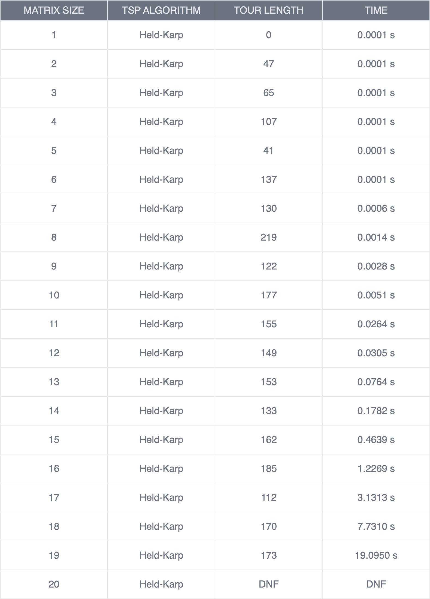
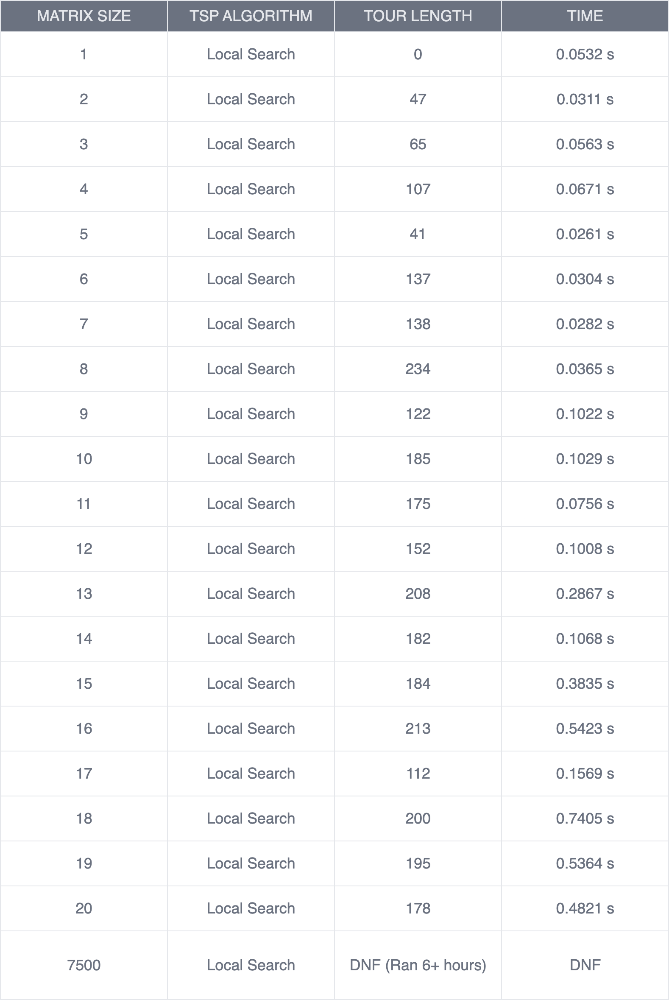
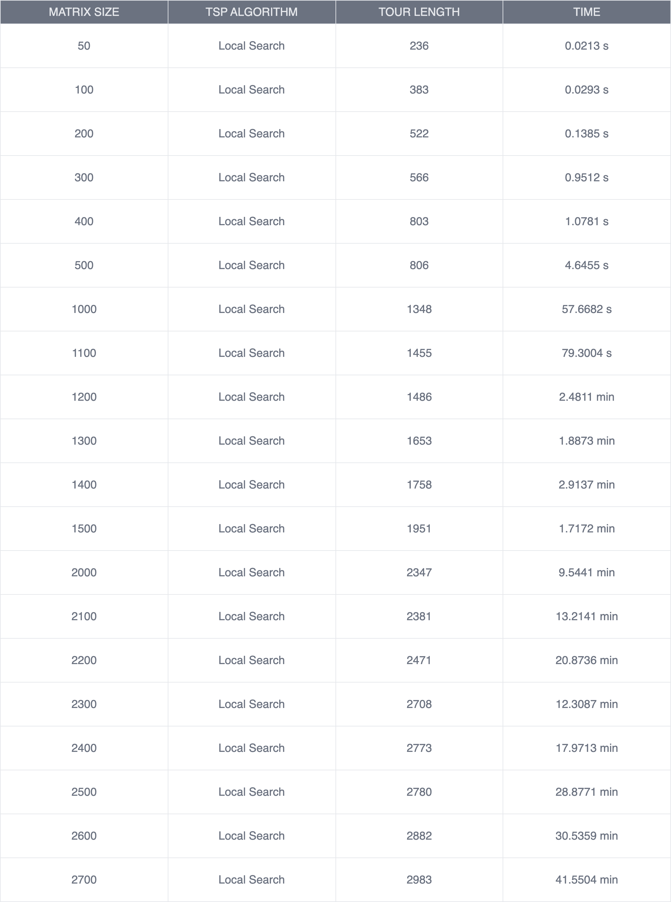
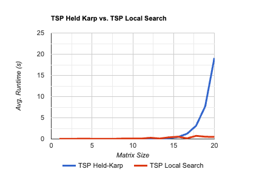

# Traveling Salesperson Problem -- Empirical Analysis

For this exercise, you'll need to take the code from the TSP Held-Karp and TSP
Local Search exercises. This can be your own implementation or somebody else's.
You will now do an empirical analysis of the implementations, comparing their
performance. Both the Held-Karp and the Local Search algorithms solve the same
problem, but they do so in completely different ways. This results in different
solutions, and in different times required to get to the solution.

Investigate the implementations' empirical time complexity, i.e. how the runtime
increases as the input size increases. *Measure* this time by running the code
instead of reasoning from the asymptotic complexity (this is the empirical
part). Create inputs of different sizes and plot how the runtime scales (input
size on the $x$ axis, time on the $y$ axis). Your largest input should have a
runtime of *at least* an hour. The input size that gets you to an hour will
probably not be the same for the Held-Karp and Local Search implementations.

In addition to the measured runtime, plot the tour lengths obtained by both
implementations on the same input distance matrices. The length of the tour that
Held-Karp found should always be less than or equal to the tour length that
Local Search found. Why is this?

Add the code to run your experiments, graphs, and an explanation of what you did
to this markdown file.

# Answer

### Held-Karp Tours & Times

**Note:** Ran for about 5 hours on matrix size 20.

### Local Search Tours & Times

### Local Search Larger Input Runs 

**Note:** For the larger inputs runs of Local Search, I started with a 50x50 input, and incremented the size by 50 each time. The stopping number was 5000. I finished a 2700x2700 matrix in 41 minutes. The algorithm was running for just under 7 hours on my machine.

### Completion Times Graphed for Held-Karp and Local Search

### Final Analysis

Held-Karp always has a shorter tour the Local Search because Held-Karp finds the best solution possible. That is also why Held-Karp can only *(reasonably)* calculate up to a 19x19 matrix without becoming pretty much computationally impossible because it has a time complexity of $O(n^2 \cdot 2^n)$. While Local Search will not find the best solution every time, it finds a reasonably acceptable solution in a much shorter timeframe. Local Search starts with an initial tour and attempts to iteratively improve it.

What does this mean? Local Search should be used as a solution to get a quick answer. Held-Karp is good for extreme accuracy (in smaller datasets). It is a matter of tradeoffs, and what kind of situation you will be implementing the algorithms in.

For each matrix size, I benchmarked Held-Karp and Local Search on the same exact matrix in the interest of accurate data.

ChatGPT was used to create generateDistanceMatrix().
